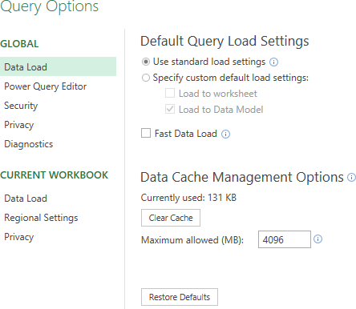

The *data model* was introduced in Excel 2010 together with the Power Pivot addin. From version 2013 the data model is fully embedded in Excel. A data model is an abstract model that organizes data in tables and can create relationships between tables.

Through *Get & Transform*, formerly called *Power Query*, you can load data from multiple data sources in Excel. At the end of the import process you have the choice to load the data to a worksheet, to the data model or to both. 

You do not always have this choice and that is caused by the default settings for loading queries. There are two ways for finding these settings:

1.  In Excel: tab Data > Get Data (group Get & Transform Data) > Query Options
2.  In Power Query Editor: File > Options & Settings > Query Options

In both cases you get

With standard load settings, the data is loaded to a new workdheet when loading a single query. When you import two or more tables then a data model is created automatically. You can override these settings for a given query using the Load To dialog window.

Met de standaardinstellingen voor het laden worden de gegevens naar een nieuw werkblad geladen als er één query wordt geladen. Wanneer je twee of meer tabellen importeert wordt automatisch een gegevensmodel gemaakt. Je kunt het dialoogvenster Laden naar gebruiken om deze instellingen voor een bepaalde query te overschrijven.
