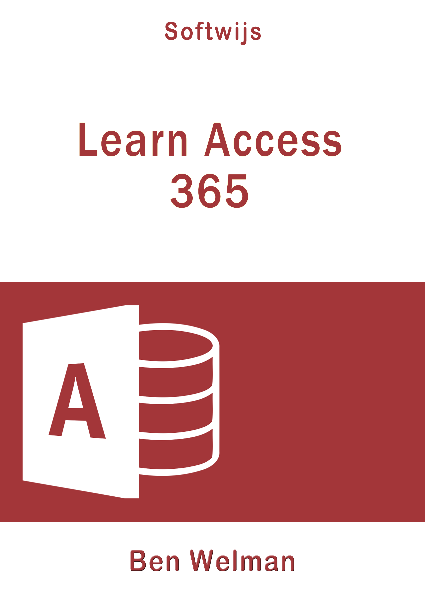

```{r echo=FALSE, out.width="25%"}

```

A task-oriented textbook developed for students in secondary and higher education. A lot of attention for creating queries, forms and reports. The book contains many exercises. The study book can also be used for other Access versions such as 2016 and 2019.

-  Free online edition: [Learn Access  - online](https://learnaccess.netlify.app/)
-  Buy digital edition: [Learn Access  -  PDF/EPUB](https://gum.co/deAkp)

[Download Practice files LearnAccess](Practicefiles-LearnAccess.zip)
