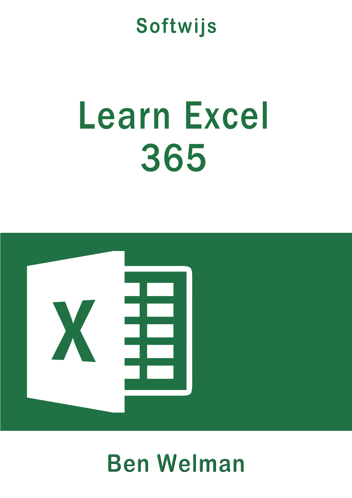

```{r echo=FALSE, out.width="25%"}

```

A task-oriented textbook developed for students in secondary and higher education. Also very suitable for anyone who wants to use Excel for data analysis. The book contains many exercises. For the most part, the study book can also be used for other Excel versions such as 2010, 2013, 2016 and 2019.

-  Free online edition: [Learn Excel - online](https://learnexcel.netlify.com)
-  Buy digital edition: [Learn Excel -  PDF/EPUB](https://gum.co/Ovtymt)

[Download Practice files LearnExcel](Practicefiles-LearnExcel.zip)


